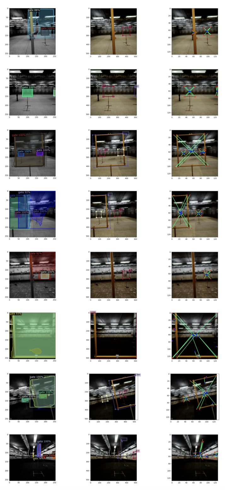
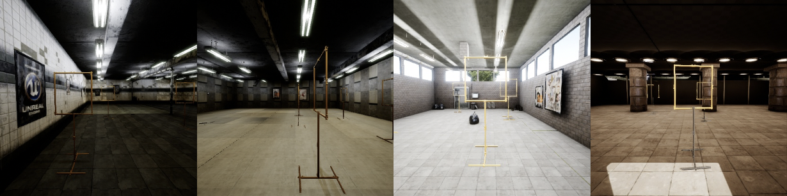

# Vertex-Voting-Based Polygonal Object Detection     
This repository contains the PyTorch implementation of my master thesis: [*Vertex-voting-based polygonal object detection*](https://repository.tudelft.nl/islandora/object/uuid%3Abb56b035-91c7-4874-b20a-805950af2d82?collection=education)

# Introduction     
Vertex-Voting-Based Polygonal Object Detection framework is an approach to extract objects' polygonal representations. This framework uses a proposal-free voting method which is proved to be more robust to occlusion scenarios. The framework contains two stages, one is multi-task learning which is used for the extraction of geometrical cues, another is a post-processing stage which is a combination of several unsupervised learning algorithms

# Results    
Results of the Vertex-Voting-Based Polygonal Object Detection framework. The first column is results from Mask R-CNN, column 2 and 3 are from our design        

# Code Structure      
```bash
########################### Code ###########################
condig/
    wireframe.yaml                  # hyper-parameters and configurations for multi-task learning stage
data/
    crowdAI_converter.py            # convert crowdAI dataset to the format which can be used by the framework(not used in gate dataset)
    processing_mydata.py            # data converter used in early stage of the work, not useful now
dataset/
    gaussian_aug.py                 # script related to gaussian augmentation
    wireframe.py                    # script related to the pre-processing of dataset
    wireframe_recal.py              # script related to the pre-processing of dataset, where ground truth polygons are recalculated if their vertices are out off image space
lcnn/                               
    models/                         
        __init__.py
        box.py                      # improved dictionary access through dot notation with additional tools.
        config.py                   # create dict that stores all the configuration
        datasets.py                 # dataset loader
        metric.py
        postprocess.py              # script related the to post-processing stage in early stage of the work, not useful now
        postprocess_no_center.py    # script related the to post-processing stage
        trainer.py                  # trainer
        utils.py                    # utils
logs/                               # default folder for storing the output during training
mAP/
    input/
    output/                         # output of evaluation
    scripts/
    evaluate.py                     # measures for evaluation
padding/                            # codes and pictures used in padding experiments
AutomaticWeightedLoss.py            # dynamic loss weights for multi-task learning stage
eval_mAP.py                         # evaluate using mAP and mAR
lcnn.sbatch                         # script for job submission on cluster
process.py                          # not useful now
test.py                             # visualize network output for debugging
train.py                            # script for training the multi-task learning network
```

# Reproducing Results       
## dataset
The dataset used in this paper is from [*P. Duernay's work*](https://repository.tudelft.nl/islandora/object/uuid%3A82cb0f68-061e-4346-b536-a35a61621e51?collection=education). Download is not provided in this repository, please contact the author if you want to use it. Examples:       

## installation      
The software and their versions used in this paper are as follows:
```
Pytorch 1.6.0
Python 3.6.9
torchvision 0.7.0
```
## trained model     
The trained model *checkpoint_latest.pth* used in the paper can be found in downloaded in this [*link*](https://1drv.ms/u/s!ArUa6rRh8DPQ0CPd7D5A6c8rg08s?e=ofnrhK)  
This model is trained on *2 NVIDIA GeForce RTX 2080 Ti for 100 epoches*.       
As for *checkpoint_best.pth* has some issues and cannot provide best performance.      
## Training     
1.Processing the Dataset:     
Taking gate dataset as an example. Arrange the .xml annotations and their corresponding images as:     
```
Dataset/
    train/      # used for training
    valid/      # used for validation
```
Then call:       
```
python3 dataset/wireframe_recal.py .../Dataset .../Destination
```
2.Training:      
adjust dataset path and other hyperparameters in *config/wireframe.yaml*      
Then call:    
```
python3 ./train.py -d 0,1... --identifier baseline config/wireframe.yaml
```
After training, the model will be saved in *logs/*        
Hyperparameters for post-processing stage can be tuned on validation set. Those hyperparameters can be found in *lcnn/postprocess_no_center.py*      

## Padding the dataset     
To validate performance on occlusion scenarios, several textures can be padded in the center of objects using:    
```
python3 padding/padding.py .../Source .../Destination
```

## Evaluation      
Call:    
```
python3 eval_mAP.py config/wireframe.yaml logs/.../checkpoint_best.pth .../Dataset .../Output_image_path --plot
```
The mAP and mAR will be shown in terminal, as well as the computation time.
AP/AR at different IOU threshold can be found in *mAP/output/class/*
    


